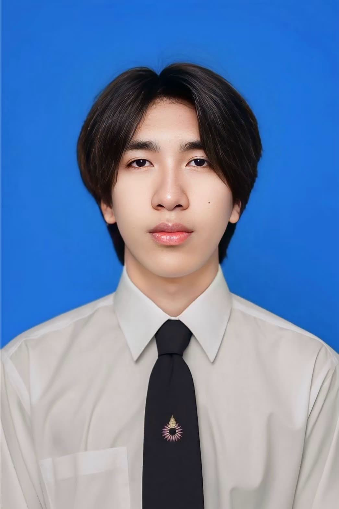

<div align="center">
  
  
  <h1 align="center">👨‍💻 Naphatcharakan's Personal Portfolio</h1>
  
  <p align="center">
    <strong>A responsive, fully-featured personal portfolio website showcasing my projects, skills, and experience as a Computer Science student and Web Developer.</strong>
  </p>

  <div>
    
    
    
  </div>
</div>

<br />

## 🌟 Overview

Welcome to the source code of my personal portfolio website, deployed via **GitHub Pages**. This website serves as an interactive resume that details my educational background at Rangsit University, my professional experience as a Web Developer Intern, and my favorite technical projects.

**🔗 Live Website:** [https://novterss.github.io/](https://novterss.github.io/)

---

## ✨ Features

- **🌓 Dark / Light Mode:** Built-in seamless theme switching using native CSS variables and JavaScript.
- **🌐 Bilingual (EN / TH):** Fully integrated English and Thai translations that can be toggled without reloading the page.
- **📱 Fully Responsive:** Carefully crafted with responsive design principles to ensure a perfect layout across all devices (Desktop, Tablet, Mobile).
- **🎨 Modern UI/UX:** Features smooth scrolling, floating navigation bars, typing animation effects, and sleek CSS transitions.

---

## 🚀 Featured Projects

Here are some of the key projects featured on the portfolio:
- **Doseries:** A streaming platform interface.
- **EZPlayStoreTH:** A digital storefront and gaming marketplace.
- **Zen Downloader:** A comprehensive downloading application.
- **LINE OA Integration:** Custom automated workflows and bots for LINE Official Accounts.

---

## 📂 Repository Structure

The project is built entirely with vanilla web technologies, keeping it lightweight and fast:

```text
novterss.github.io/
│
├── index.html              # Main portfolio page (Structure & Content)
├── cv.html                 # Dedicated CV viewer page
├── style.css               # All custom styling, themes, and animations
├── script.js               # Logic for toggling languages, themes, and interactions
├── *.jpg / *.png           # Project screenshots and personal assets
└── *.pdf                   # Downloadable Resume/CV files (Eng & Thai)
```

---

## 🏃 Getting Started

Since this is a static website, you don't need any complex build tools to run it locally.

1. **Clone the repository:**
   ```bash
   git clone https://github.com/novterss/novterss.github.io.git
   ```
2. **Navigate to the directory:**
   ```bash
   cd novterss.github.io
   ```
3. **Open `index.html`** directly in your preferred web browser, or use an extension like **Live Server** in VS Code for hot reloading.

---

<div align="center">
  <p>Designed and Built by <strong>Naphatcharakan Phatchaiphongsa</strong></p>
  <a href="https://github.com/novterss">
    
  </a>
  <a href="mailto:phatchaiphongsa@gmail.com">
    
  </a>
</div>
```
